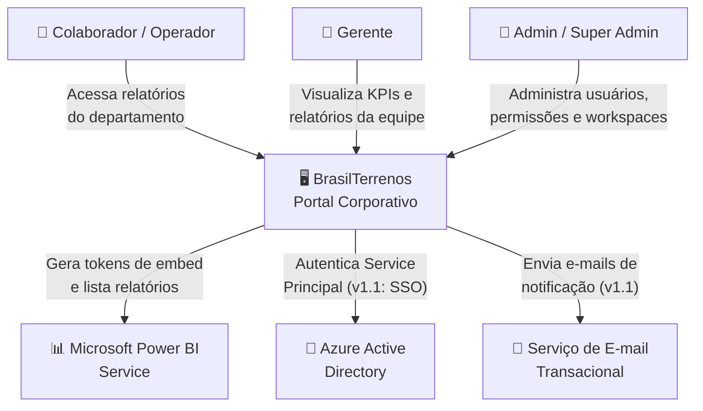
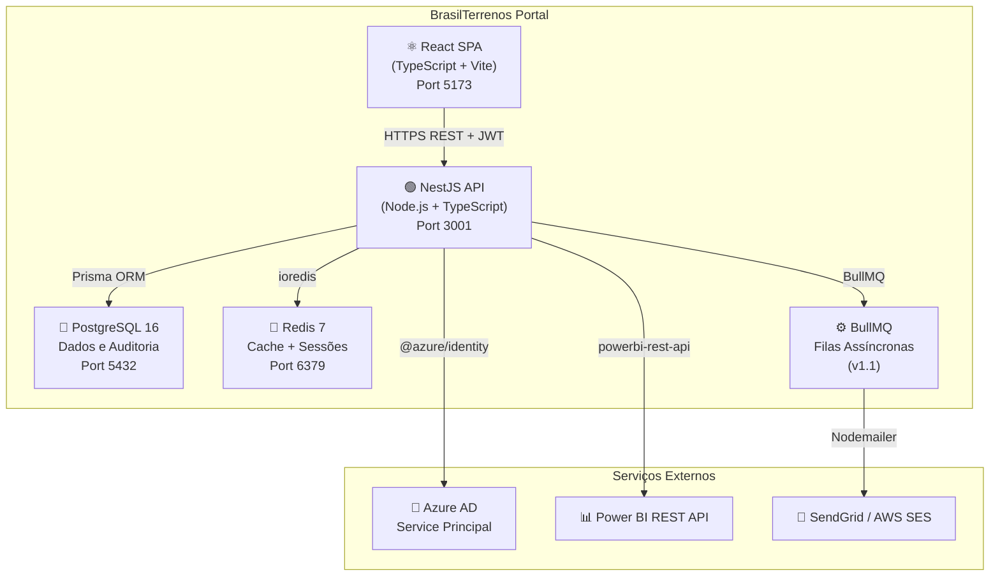
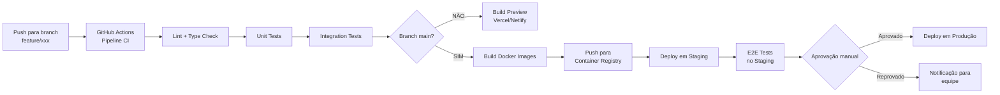

# Diagramas do Sistema

> **Documento:** 06-arquitetura/03-diagramas.md  
> **Status:** Rascunho  
> **Criado em:** Maio/2026  
> **Atualizado em:** Maio/2026

> **Nota:** Os diagramas abaixo estão em formato texto/ASCII para edição e versão em repositório. Para visualização gráfica, recomenda-se importar as descrições no **draw.io**, **Mermaid Live Editor** ou **PlantUML**.

---

## 1. Diagrama de Contexto (C4 — Nível 1)



---

## 2. Diagrama de Containers (C4 — Nível 2)



---

## 3. Diagrama de Componentes — Módulo Auth (C4 — Nível 3)

```mermaid
graph LR
    subgraph "AuthModule (NestJS)"
        AC[AuthController]
        AS[AuthService]
        LS[LocalStrategy\n(validação login)]
        JS[JwtStrategy\n(validação token)]
        JG[JwtAuthGuard]
        RG[RolesGuard]
        PG[PermissionsGuard]
        SG[ScheduleGuard]
    end

    subgraph "Dependências"
        US[UsersService]
        SS[ScheduleService]
        RS[Redis Service]
        AL[AuditService]
    end

    AC --> AS
    AS --> LS
    AS --> JS
    AS --> US
    AS --> SS
    AS --> RS
    AS --> AL
    JG --> JS
    RG --> US
    PG --> US
    PG --> RS
    SG --> SS
```

---

## 4. Diagrama de Sequência — Autenticação

```
Browser           API                PostgreSQL           Redis

  │  POST /auth/login  │                  │                │
  │──────────────────▶│                  │                │
  │                    │── findUser() ───▶│                │
  │                    │◀── user ─────────│                │
  │                    │── bcrypt.compare()                │
  │                    │── checkStatus()                   │
  │                    │── checkSchedule() ──▶│            │
  │                    │◀── allowed ──────────│            │
  │                    │── signJWT()                       │
  │                    │── store refresh ────────────────▶│
  │                    │── auditLog.insert() ─▶│          │
  │◀── 200 { accessToken }                     │          │
  │    Set-Cookie: refresh=... (httpOnly)       │          │
```

---

## 5. Diagrama de Sequência — Embed de Relatório PBI

```
Browser           API               Redis        Azure AD        PBI API

  │ GET /reports/:id/embed-token │        │              │            │
  │────────────────────────────▶│        │              │            │
  │                              │        │              │            │
  │              ── checkRBAC() ─────────────────────────            │
  │              ◀─ permitido ──────────────────────────             │
  │                              │        │              │            │
  │              ── GET pbi_token:{id} ──▶│              │            │
  │              ◀─ MISS (sem cache) ─────│              │            │
  │                              │        │              │            │
  │              ── POST /oauth2/token ──────────────────▶           │
  │              ◀─ azure_access_token ───────────────────           │
  │                              │        │              │            │
  │              ── POST GenerateToken ─────────────────────────────▶│
  │              ◀─ embedToken, embedUrl ───────────────────────────│
  │                              │        │              │            │
  │              ── SET pbi_token (TTL 55min) ──▶│       │            │
  │              ── auditLog.insert()            │                    │
  │◀── 200 { embedToken, embedUrl, reportId } ───│                    │
  │                              │                                    │
  │── powerbi.embed(config) ─────────────────────────────────────────│
  │◀─ Relatório renderizado ─────────────────────────────────────────│
```

---

## 6. Diagrama de Sequência — Renovação de Token

```
Browser (Axios Interceptor)       API                   Redis

  │                               │                       │
  │ [Token expira em < 5 min]     │                       │
  │ [OU 401 em requisição]        │                       │
  │                               │                       │
  │── POST /auth/refresh ────────▶│                       │
  │   Cookie: refresh_token        │                       │
  │                               │── GET refresh:{id} ──▶│
  │                               │◀─ token válido ────────│
  │                               │── checkUserActive()    │
  │                               │── sign new accessToken │
  │                               │── rotate refreshToken ─▶│
  │◀── 200 { accessToken } ───────│                       │
  │                               │                       │
  │ [Repete requisição original]  │                       │
```

---

## 7. Fluxo de Deploy (CI/CD)



---

## 8. Diagrama de Casos de Uso Simplificado

```
┌──────────────────────────────────────────────────────────┐
│                    PORTAL BRASILTERRENOS                  │
│                                                          │
│  ┌─────────────────────────────────────────────────────┐ │
│  │ MÓDULOS DE CONSUMO                                   │ │
│  │  ○ Login / Logout         Todos os usuários ────────┼─┤
│  │  ○ Visualizar relatórios  Operador+ ────────────────┼─┤
│  │  ○ Navegar workspaces     Operador+ ────────────────┼─┤
│  │  ○ Gerenciar favoritos    Operador+ ────────────────┼─┤
│  └─────────────────────────────────────────────────────┘ │
│                                                          │
│  ┌─────────────────────────────────────────────────────┐ │
│  │ MÓDULOS ADMINISTRATIVOS                              │ │
│  │  ○ Gerenciar usuários     Admin+ ───────────────────┼─┤
│  │  ○ Gerenciar permissões   Admin+ ───────────────────┼─┤
│  │  ○ Gerenciar workspaces   Admin+ ───────────────────┼─┤
│  │  ○ Configurar expediente  Admin+ ───────────────────┼─┤
│  │  ○ Consultar logs         Admin+ ───────────────────┼─┤
│  │  ○ Painel de segurança    Admin+ ───────────────────┼─┤
│  │  ○ Configurações do PBI   Super Admin ──────────────┼─┤
│  └─────────────────────────────────────────────────────┘ │
└──────────────────────────────────────────────────────────┘
```

---

## Ferramentas Recomendadas para Diagramas

| Ferramenta | Uso | URL |
|------------|-----|-----|
| Mermaid Live | Diagramas de fluxo e sequência inline | https://mermaid.live |
| draw.io / diagrams.net | Diagramas C4, arquitetura | https://draw.io |
| PlantUML | Diagramas UML textuais | https://plantuml.com |
| Excalidraw | Diagramas informais e whiteboards | https://excalidraw.com |
| Structurizr | Diagramas C4 completos | https://structurizr.com |

---

## Histórico de Alterações

| Versão | Data | Autor | Descrição |
|--------|------|-------|-----------|
| 1.0 | Maio/2026 | — | Criação inicial do documento |